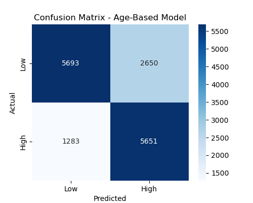
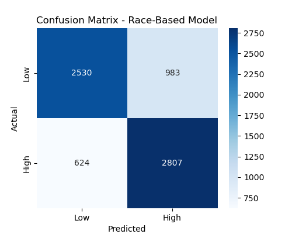

# Seasonal Flu Hospitalization Prediction: ML Model Results

<a href="index.html" class="healthify-banner">Healthify</a>

---

## **Methodology & Key Results Summary**

We developed a **logistic regression model** to classify **high vs. low seasonal flu hospitalization incidence** based on **age group** and **race category**. The dataset includes multiple flu seasons, and **SMOTE** was applied to address class imbalance before training (Rahim 2019, Huyen 2022).

- **Age-Based Model:** **74.3% accuracy**  
  - Performed well but had some misclassification of high-incidence cases.
- **Race-Based Model:** **76.9% accuracy**  
  - Slightly better performance, with higher recall for high-incidence cases.
- **Confusion Matrix Insights:**  
  - Most misclassifications were **false positives** (overestimating high incidence).
  - **Race appears to be a stronger predictor** than age alone.

---

## **ML Model Inference**
Age: <select id="age">
  <option value="">Age</option>
  <option value="0">0-17</option>
  <option value="1">18-49</option>
  <option value="2">50-64</option>
  <option value="3">65-74</option>
  <option value="4">75-84</option>
</select> 

Race: <select id="race">
  <option value="">Race</option>
  <option value="0">American Indian/Alaska Native</option>
  <option value="1">Asian/Pacific Islander</option>
  <option value="2">Black</option>
  <option value="3">Hispanic/Latino</option>
  <option value="4">White</option>
</select> 

---

## **Model Performance Metrics Table**
This table summarizes the accuracy, precision, recall, and F1-score for each model.

<iframe title="Flu Hospitalization ML Model Performance" 
        aria-label="Table" 
        id="datawrapper-chart-uEwrh" 
        src="https://datawrapper.dwcdn.net/Jr9zx/2/" 
        scrolling="no" frameborder="0" 
        style="width: 0; min-width: 100% !important; border: none;" 
        height="188" data-external="1">
</iframe>

---

## **Confusion Matrix: Model Predictions vs. Actual Data**
The confusion matrix visualizes **model misclassifications**, showing how often high and low hospitalization rates were correctly predicted.

 

---
